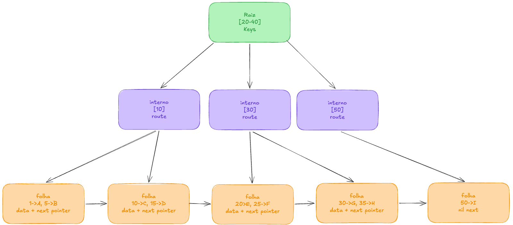

## requirements

```

Tree Data Structures Kata
1. What is the use case for you DS?
2. What are the pros and cons?
3. Show de Code
4. Show de Tests

Requiremente B+ Tree in Go + Tests.
```
## estudo




Verde: ponto de entrada da arvore, armazena as keys, que sao usadas para direcionamento, ex: buscou o valor menor que 20, vai pra esquerda, entre 20 e 40, vai pro meio, maior que 40 pra direita. 

Roxo: nivel de roteamento, mesma logica inicial de encaminhamento, sempre comparando chave valor. 

laranja: nivel folha, onde ficam os dados de verdade, dados sao armazenados em pares de chave ae valor. todos as folhas sao interligadas em sequencia, formando uma linked list, ultimo nó (final) termina em nil next ( sem proximo)

ex: buscar dados entre 10 e 35, tem que descer a arvore ate o 10, e percorrer para direita ate o 35.
evita necessidade de subir os niveis novamente.


## run go
``` 
go mod init bplustree

```